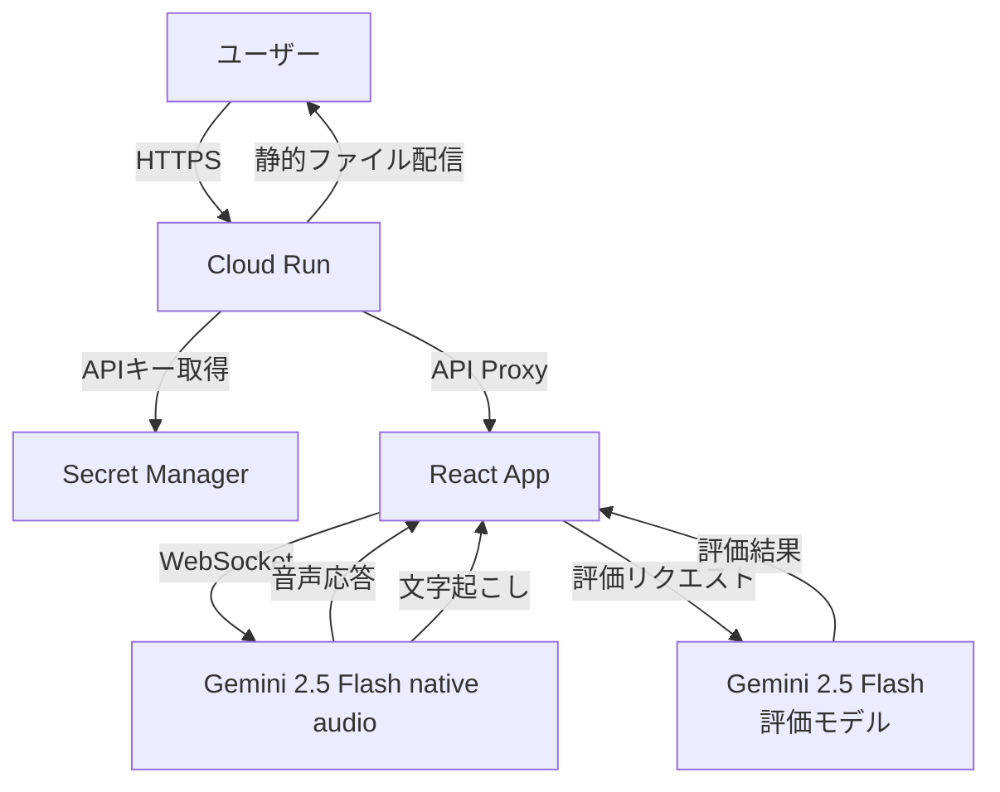
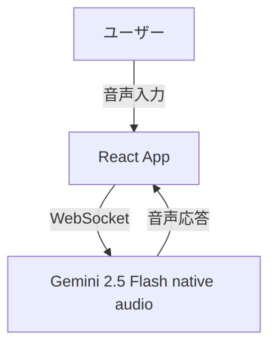

# Live Talk App - リアルタイム音声対話アプリケーション

Google Gemini API (Multimodal Live API) を活用したリアルタイム音声対話 React アプリケーションです。
Gemini 2.5 Flash Native Audio モデルとの低遅延な音声対話と、AI による会話セッション評価機能を提供します。

## 📖 特徴


- **リアルタイム音声対話**: Gemini 2.5 Flash Native Audio モデルとの低遅延な双方向音声会話
- **音声文字起こし**: 入力・出力音声の日本語リアルタイム文字起こし（ja-JP 対応）
- **セッション評価機能**: 会話終了後に AI が感情分析・エンゲージメント評価を実施
- **視覚的フィードバック**: 評価結果をモーダルで分かりやすく表示
- **ビデオストリーミング**: Webcam/画面共有によるビジュアル入力対応
- **カスタマイズ可能**: 音声設定、システムインストラクション、レスポンスモダリティの調整
- **セキュア**: API キーをサーバー側で管理（Cloud Run 対応）
- **最適化された音声処理**: 24kHz AudioContext、30ms チャンク送信、300ms 音声バッファ
- **日本語 VAD 最適化**: 無音判定 800ms、低感度設定で音声途切れを防止

## 🏗️ アーキテクチャ

### 本番環境（Cloud Run）



### 開発環境



## 📂 プロジェクト構成

```text
.
├── .github/
│   └── workflows/
│       └── deploy.yml           # CI/CD設定（Cloud Run）
├── public/                      # 静的ファイル
├── src/
│   ├── components/
│   │   ├── altair/             # Altairグラフ描画
│   │   ├── audio-pulse/        # 音声レベル可視化
│   │   ├── control-tray/       # 接続・録音制御UI
│   │   ├── evaluation-modal/   # セッション評価結果表示
│   │   ├── logger/             # デバッグログ表示
│   │   ├── settings-dialog/    # 設定ダイアログ
│   │   ├── side-panel/         # サイドパネル
│   │   └── transcription/      # 文字起こし・評価UI
│   ├── contexts/
│   │   └── LiveAPIContext.tsx  # Gemini API接続管理
│   ├── hooks/                   # カスタムフック
│   ├── lib/
│   │   ├── genai-live-client.ts      # Gemini Live API クライアント
│   │   ├── evaluation-service.ts     # セッション評価サービス
│   │   ├── api-config.ts             # APIキー取得ユーティリティ
│   │   ├── audio-recorder.ts         # 音声録音
│   │   └── audio-streamer.ts         # 音声再生
│   ├── types.ts                # TypeScript型定義
│   └── App.tsx                 # メインアプリケーション
├── server.js                   # Express サーバー（本番用）
├── Dockerfile                  # Docker イメージ定義
├── .dockerignore               # Docker ビルド除外設定
├── setup-gcp.sh               # GCP セットアップスクリプト
├── app.yaml                   # App Engine設定（非推奨）
├── package.json
└── tsconfig.json
```

## 🚀 ローカルでのセットアップと実行

### 前提条件

- Node.js 20 以上
- npm または yarn
- Gemini API キー

### 1. 依存関係のインストール

```bash
npm install
```

### 2. 環境変数の設定

プロジェクトルートに `.env` ファイルを作成し、以下を設定：

```bash
# Gemini API キー（必須）
GEMINI_API_KEY=your_gemini_api_key_here

# 開発環境用（React開発サーバー使用時）
REACT_APP_GEMINI_API_KEY=your_gemini_api_key_here
```

> **注意**: `dotenv-flow` を使用しているため、`.env` ファイルが自動的に読み込まれます。

### 3. アプリケーションの起動

#### 開発モード（React 開発サーバー）

```bash
npm run dev
```

ブラウザで `http://localhost:3000` が自動的に開きます。

#### 本番モード（Express サーバー）

```bash
# Reactアプリをビルド
npm run build

# Expressサーバーを起動
npm start
```

ブラウザで `http://localhost:8080` にアクセスします。

## 🌐 Cloud Run へのデプロイ

### クイックスタート

```bash
# 1. GCP リソースのセットアップ
./setup-gcp.sh

# 2. Docker イメージをビルドしてデプロイ
gcloud builds submit --tag asia-northeast1-docker.pkg.dev/PROJECT_ID/live-talk-app/live-talk-app:latest

gcloud run deploy live-talk-app \
  --image asia-northeast1-docker.pkg.dev/PROJECT_ID/live-talk-app/live-talk-app:latest \
  --region asia-northeast1 \
  --allow-unauthenticated \
  --set-secrets=GEMINI_API_KEY=gemini-api-key:latest
```

## 🔒 セキュリティ

### セキュリティベストプラクティス

1. ✅ API キーは GitHub Secrets で管理
2. ✅ 非 root ユーザーでコンテナを実行
3. ✅ 最小権限の原則（IAM）
4. ✅ HTTPS のみでアクセス可能

---

## 🎯 主要機能

### 1. リアルタイム音声対話

- **接続**: 画面下部の再生ボタンをクリック
- **音声入力**: マイクボタンでミュート/ミュート解除
- **応答**: AI からの音声応答がリアルタイムで再生

### 2. 文字起こし機能

- 入力音声と出力音声を自動で文字起こし
- タイムスタンプ付きで表示
- セッション開始時に自動クリア

### 3. セッション評価機能 ⭐ NEW

会話終了後、以下の項目を自動評価：

- **😊 感情分析**: ポジティブ/ネガティブ/中立の判定とスコア
- **🔥 エンゲージメント**: 会話の積極性レベル
- **💡 トピック**: 会話の主要な話題
- **📈 改善提案**: コミュニケーション向上のアドバイス
- **📝 要約**: 会話全体の簡潔なまとめ

**使い方:**

1. セッションを終了（disconnect）
2. 📊 評価ボタンをクリック
3. AI による評価結果がモーダルで表示

---

## ⚙️ 設定オプション

設定ダイアログ（歯車アイコン）から以下を調整可能：
- **システムインストラクション**: AI の振る舞いをカスタマイズ

---

## 🛠 技術スタック

- **フロントエンド**: React 18, TypeScript
- **バックエンド**: Express.js（API プロキシサーバー）
- **状態管理**: React Hooks, Zustand
- **スタイリング**: SCSS
- **AI/ML**: Google Generative AI SDK (@google/genai v0.14.0)
- **音声処理**: Web Audio API (24kHz), AudioWorklet (30ms チャンク)
- **ビルド**: Create React App
- **デプロイ**: Google Cloud Run（Docker）
- **CI/CD**: GitHub Actions（Workload Identity Federation）
- **シークレット管理**: Google Secret Manager

---

## 📦 主要な依存パッケージ

```json
{
  "@google/genai": "^0.14.0",
  "react": "^18.3.1",
  "express": "^4.18.2",
  "dotenv-flow": "^4.1.0",
  "eventemitter3": "^5.0.1",
  "vega-embed": "^6.29.0",
  "zustand": "^5.0.1"
}
```

---

## 🚀 デプロイ

### 本番環境: Google Cloud Run

本アプリケーションは **Google Cloud Run** 上でコンテナとして稼働しています。

**デプロイ構成:**

- **ランタイム**: Node.js 20 (Alpine Linux)
- **リージョン**: asia-northeast1 (東京)
- **メモリ**: 512Mi
- **CPU**: 1
- **自動スケーリング**: 0-10 インスタンス
- **タイムアウト**: 1200 秒
- **認証**: 未認証アクセス許可（IP 制限推奨）

### GitHub Actions による自動デプロイ

main ブランチへの push 時に自動的に Cloud Run にデプロイされます。

**デプロイフロー:**

1. Workload Identity Federation で認証
2. Secret Manager に `gemini-api-key` を作成（初回のみ）
3. Docker イメージをビルド（GitHub Actions 内）
4. Artifact Registry にプッシュ
5. Cloud Run にデプロイ
6. Secret Manager から環境変数を注入

プルリクエスト時はビルド検証のみが実行されます（デプロイなし）。

### 必要な GitHub Secrets
`.env.example` を参照

## 🔗 リンク

- [Google Generative AI Documentation](https://ai.google.dev/gemini-api/docs)
- [Multimodal Live API Guide](https://ai.google.dev/gemini-api/docs/live)
- [GitHub Repository](https://github.com/ktwebsite/live_talk_app_realtime)
